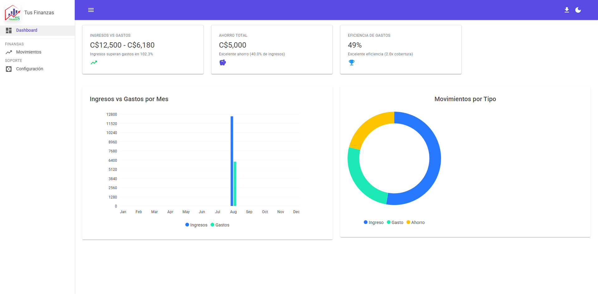
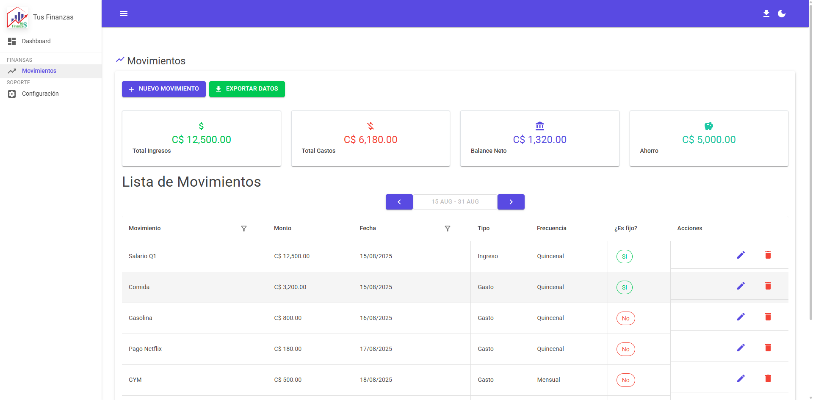
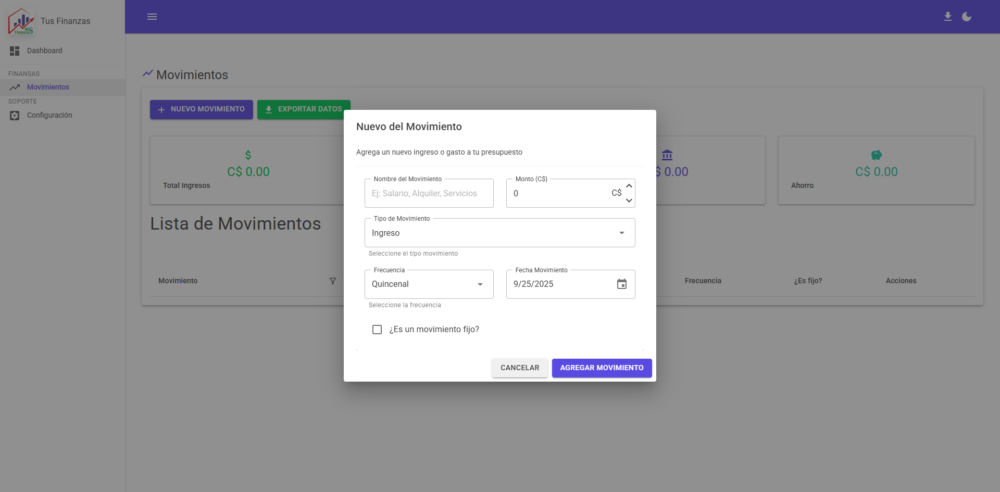




# Mis Finanzas - Control de Gastos con Blazor

Una aplicación web ligera de control de gastos [Ver la app en vivo](https://juliosanchezs.github.io/ControlDeGastosBlazor/) 🚀, desarrollada con **Blazor WebAssembly**, **MudBlazor**, **Local Storage** y **ClosedXML**. Permite registrar tus gastos e ingresos, visualizar resúmenes y exportar tus datos a Excel.


  

## Características

- Registrar gastos, ingresos y ahorro
- Dashboard de resumen con gráficos
- Guardado de datos en **Local Storage**
- Exportar registros a **Excel** usando **ClosedXML**
- Integración con JavaScript a través de **IJSRuntime**
- Interfaz moderna y responsiva con **MudBlazor**
- 100% cliente, no requiere backend
- Modo Oscuro

## Tecnologías

- [Blazor WebAssembly](https://dotnet.microsoft.com/apps/aspnet/web-apps/blazor)
- [MudBlazor](https://mudblazor.com/)
- [ClosedXML](https://github.com/ClosedXML/ClosedXML)
- **C#**, **HTML**, **CSS**
- Local Storage
- JavaScript (integración con IJSRuntime)

## Instalación

1. Clonar el repositorio:
   ```bash
   git clone https://github.com/JulioSancheZS/ControlDeGastosBlazor
